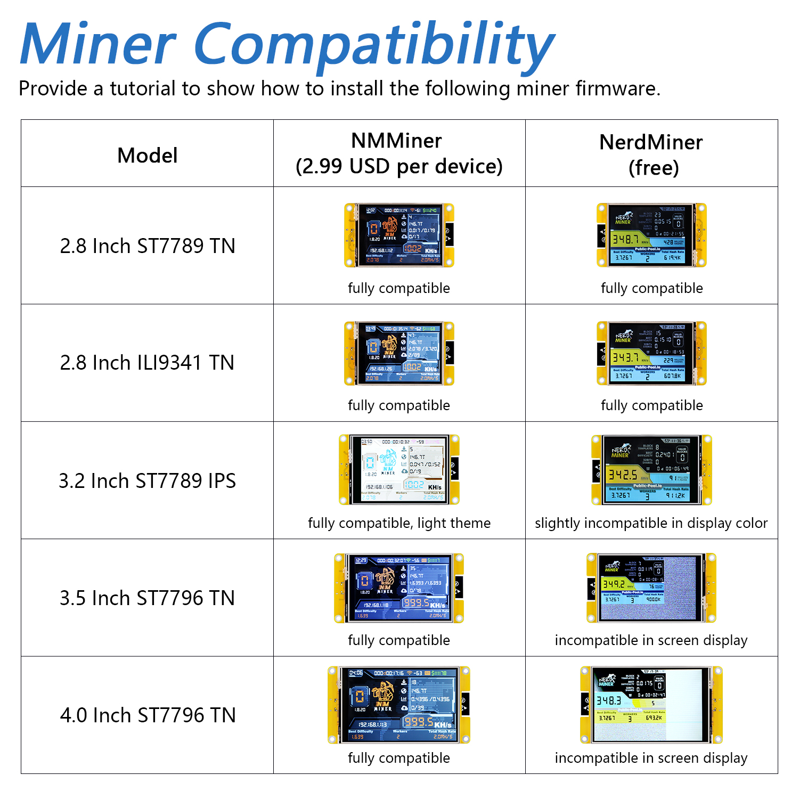

##############################################################################
Preface
##############################################################################

This tutorial aims to introduce two excellent Bitcoin Mining projects. Freenove has adapted and validated these projects to ensure stable operation on our Freenove ESP32 Display, and have accordingly compiled detailed usage tutorials.

:combo:`red font-bolder:Disclaimer:`

:red:`Freenove is not the original developer of these projects. All development, maintenance, feature implementation, and commercial licensing are the sole responsibility of their respective official developers.`

