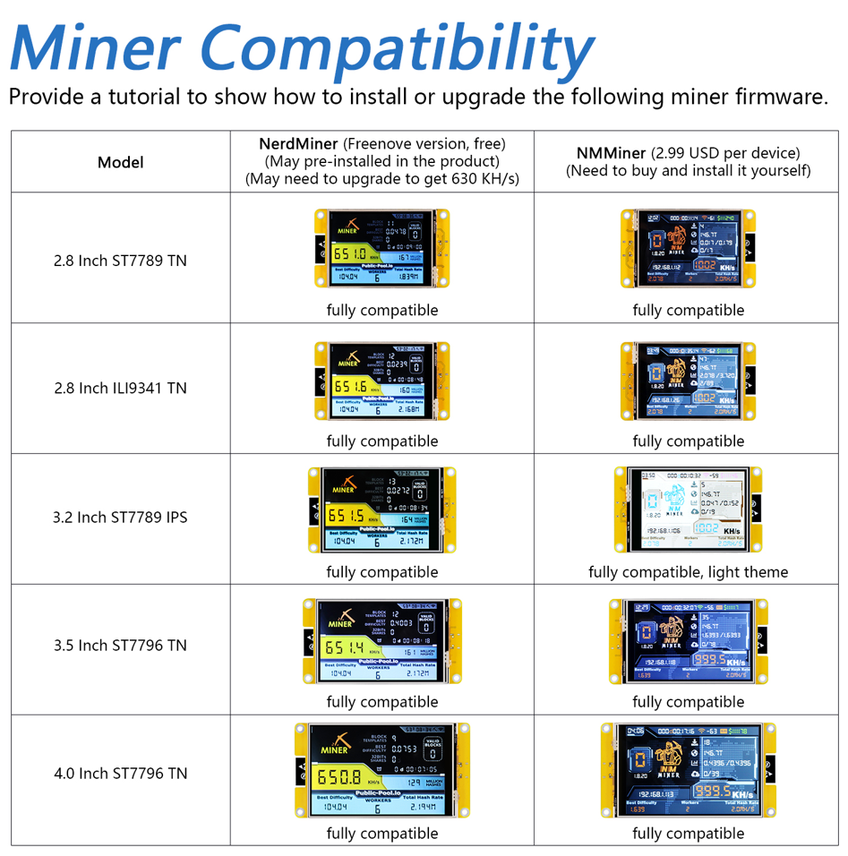

##############################################################################
Preface
##############################################################################

Important Notes
******************************

When you first power on the Freenove ESP32 Display, one of the following two interfaces may occur.

LVGL Demo
=======================

Some models may display a dynamic demo interface, featuring a modern user profile UI. 

:combo:`red font-bolder:Please rest assured! This is not "malicious software" or a "used device."`

This is a classic **benchmark/demo program** built on LVGL, a popular open-source embedded graphics library. It serves as an industry-standard tool to evaluate and demonstrate the development board's performance in rendering smooth graphics, handling animations, and supporting responsive touch interactions. You can easily overwrite it by **uploading a new sketch**. When you follow the tutorial to upload your first program, this demo will be automatically erased and replaced.

.. image:: ../_static/imgs/NerdMiner_v2/NerdMiner57.png
    :align: center

All models of the Freenove ESP32 Display are compatible with :ref:`NerdMiner <fnk0103/codes/miner/nerdminer_v2:nerdminer_v2 (freenove miner)>` and :ref:`NMMiner <fnk0103/codes/miner/nmminer:nmminer>`. Although the device does not come with the firmware pre-installed, there's no need to worry. We provide a convenient **web-based online flashing tool** and **a complete flashing tutorial**. There's no need to download any complex software. You can easily complete the flashing process in just a few minutes by selecting the firmware that matches your device model.

.. image:: ../_static/imgs/NerdMiner_v2/NerdMiner58.png
    :align: center

**If you have any concerns, please feel free to contact us via** support@freenove.com

NerdMiner_v2 (Freenove Miner)
=======================================

Some displays have been preinstalled with the NerdMiner_V2 firmware, and the following interface will show up. In this case, you can directly :ref:`make configuration as per the tutorial <fnk0103/codes/miner/nerdminer_v2:wi-fi configuration>`.

.. image:: ../_static/imgs/NerdMiner_v2/NerdMiner66.png
    :align: center

The device you received may come pre-installed with either the stable version (with a computing power of approximately 350 KH/s) or the high-performance version (with a computing power of around 630 KH/s) firmware. You can quickly switch between versions within 5 minutes according to your needs. For specific steps, please refer to the section on ":ref:`Firmware Flashing & Update. <fnk0103/codes/miner/nerdminer_v2:firmware flashing & update>`"

Miner
********************************

This tutorial aims to introduce two excellent Bitcoin Mining projects. Freenove has adapted and validated these projects to ensure stable operation on our Freenove ESP32 Display, and have accordingly compiled detailed usage tutorials.

:combo:`red font-bolder:Disclaimer:`

:red:`Freenove is not the original developer of these projects. All development, maintenance, feature implementation, and commercial licensing are the sole responsibility of their respective official developers.`

