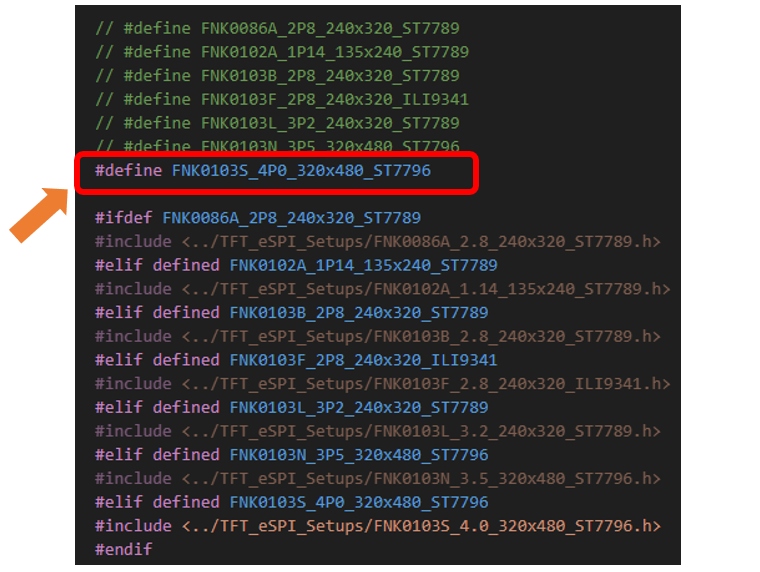
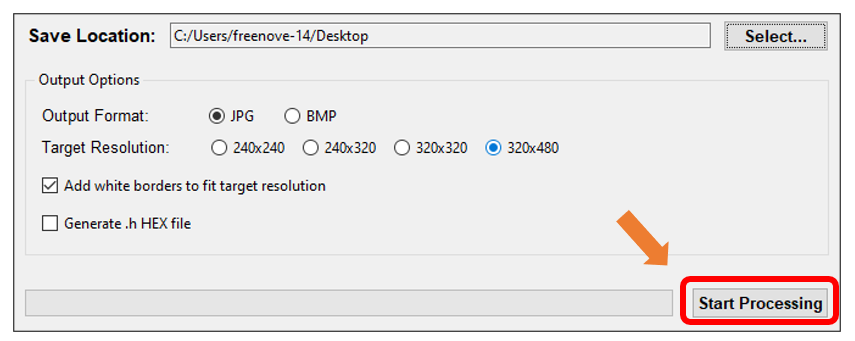

##############################################################################
Chapter 10 TFT Display
##############################################################################

Project 10.1 TFT_Rainbow
*******************************

Freenove ESP32 Display is available in five different models, each featuring a unique TFT display. This guide applies to all of them. For detailed specifications of each model, please click here.

Component List 
=================================

+----------------------------+----------------+
| Freenove ESP32 Display x 1 | USB cable x1   |
|                            |                |
| |Chapter01_02|             | |Chapter01_03| |
+----------------------------+----------------+

.. |Chapter01_02| image:: ../_static/imgs/1_Serial/Chapter01_02.png
.. |Chapter01_03| image:: ../_static/imgs/1_Serial/Chapter01_03.png

Component Knowledge
==================================

TFT Display
----------------------------------

TFT (Thin Film Transistor) is an electronic component that serves as the foundation for TFT displays, the mainstream display technology in modern laptops and desktop computers. In these displays, each individual liquid crystal pixel is controlled by its own dedicated thin-film transistor embedded directly behind it. This architecture classifies TFT screens as a form of active-matrix LCD (AMLCD) technology.

As one of the finest LCD color displays available, TFT screens offer superior performance characteristics including rapid response times, exceptional brightness levels, and outstanding contrast ratios.

Circuit
==========================

Connect Freenove ESP32 Display to the computer with USB cable.

.. image:: ../_static/imgs/1_Serial/Chapter01_04.png
    :align: center

Sketch
==========================

Open **"Sketch_10.1_TFT_Rainbow.ino"** folder under **"Freenove_ESP32_Display\\Sketch"** and double-click **"Sketch_10.1_TFT_Rainbow.ino"**.

Install Libraries

Click **Sketch** -> **Include Library** -> **Add .ZIP Library...**

Install TFT_eSPI_v2.5.43.zip and TFT_eSPI_Setups_v1.0.zip

Click File -> Preferences...

Linux and Mac users can use the cd command on Terminal to enter the sketchbook location, and Windows users can copy and paste it in the file explorer.

Double click libraries

Double click TFT_eSPI

Open the User_Setup_Select.h file

Remove the "//" comment markers from the macro definition line corresponding to your Freenove ESP32 Display model.

Here we take the 4-in display as an example, modifying it as shown below:

:red:`Important Note: Only one macro definition should be uncommented.`

Sketch_10.1_TFT_Rainbow
--------------------------------

The following is the program code:

.. literalinclude:: ../../../freenove_Kit/Sketches/Sketch_10.1_TFT_Rainbow/Sketch_10.1_TFT_Rainbow.ino
   :linenos:
   :language: c
   :dedent:

Code Explanation
---------------------------------

Include the necessary header file.

.. literalinclude:: ../../../freenove_Kit/Sketches/Sketch_10.1_TFT_Rainbow/Sketch_10.1_TFT_Rainbow.ino
   :linenos:
   :language: c
   :lines: 7-7
   :dedent:

Define TFT display object.

.. literalinclude:: ../../../freenove_Kit/Sketches/Sketch_10.1_TFT_Rainbow/Sketch_10.1_TFT_Rainbow.ino
   :linenos:
   :language: c
   :lines: 9-9
   :dedent:

Initialize the TFT display.

.. literalinclude:: ../../../freenove_Kit/Sketches/Sketch_10.1_TFT_Rainbow/Sketch_10.1_TFT_Rainbow.ino
   :linenos:
   :language: c
   :lines: 19-20
   :dedent:

Change the color of the screen in the sequence of red -> green -> blue -> black ->white.

.. literalinclude:: ../../../freenove_Kit/Sketches/Sketch_10.1_TFT_Rainbow/Sketch_10.1_TFT_Rainbow.ino
   :linenos:
   :language: c
   :lines: 22-31
   :dedent:

Implement the rainbow animation effect.	

.. literalinclude:: ../../../freenove_Kit/Sketches/Sketch_10.1_TFT_Rainbow/Sketch_10.1_TFT_Rainbow.ino
   :linenos:
   :language: c
   :lines: 38-85
   :dedent:

Text display.

.. literalinclude:: ../../../freenove_Kit/Sketches/Sketch_10.1_TFT_Rainbow/Sketch_10.1_TFT_Rainbow.ino
   :linenos:
   :language: c
   :lines: 86-93
   :dedent:

Click "Upload" to upload the code to Freenove_ESP32_Display.

The TFT screen will change colors in the order of red -> green -> blue -> black -> white before displaying text and rainbow effects.

Project 10.2 Flash JPG DMA
**************************************

Component List 
===========================

+----------------------------+----------------+
| Freenove ESP32 Display x 1 | USB cable x1   |
|                            |                |
| |Chapter01_02|             | |Chapter01_03| |
+----------------------------+----------------+

Component Knowledge
============================

DMA
----------------------------

DMA, or Direct Memory Access, is a hardware feature that allows peripherals to transfer data to and from memory without needing the CPU to be directly involved, dramatically improving overall system efficiency while minimizing processor workload.

The core mechanism of DMA relies on a dedicated DMA controller taking over data transfer tasks. The CPU only needs to initialize the transfer parameters before offloading the operation, allowing computation and I/O operations to proceed in parallel.

Circuit
============================

Connect Freenove ESP32-S3 to the computer using the USB cable. 

Sketch
============================

Click **Sketch** -> **Include Library** -> **Add .ZIP Library...**

Install **TJpg_Decoder_v1.1.0.zip**

Open **"Sketch_10.2_Flash_Jpg_DMA"** folder under **"Freenove_ESP32_Display\\Sketch"** and double-click **"Sketch_10.2_Flash_Jpg_DMA.ino"**.

Sketch_10.2_Flash_Jpg_DMA
------------------------------------

The following is the program code:

.. literalinclude:: ../../../freenove_Kit/Sketches/Sketch_10.2_Flash_Jpg_DMA/Sketch_10.2_Flash_Jpg_DMA.ino
   :linenos:
   :language: c
   :dedent:

Code Explanation
-------------------------------

Include necessary header files.

.. code-block:: c
    :linenos:

    #include <TFT_eSPI.h>  // TFT display library
    ...
    #include "panda.h"         // Include raw JPEG image data array
    #include <TJpg_Decoder.h>  // Include JPEG decoder library

Configure DMA buffer

.. literalinclude:: ../../../freenove_Kit/Sketches/Sketch_10.2_Flash_Jpg_DMA/Sketch_10.2_Flash_Jpg_DMA.ino
   :linenos:
   :language: c
   :dedent:

Create TFT object instance.

.. literalinclude:: ../../../freenove_Kit/Sketches/Sketch_10.2_Flash_Jpg_DMA/Sketch_10.2_Flash_Jpg_DMA.ino
   :linenos:
   :language: c
   :lines: 17-17
   :dedent:

JPEG decoding callback function

.. literalinclude:: ../../../freenove_Kit/Sketches/Sketch_10.2_Flash_Jpg_DMA/Sketch_10.2_Flash_Jpg_DMA.ino
   :linenos:
   :language: c
   :lines: 19-33
   :dedent:

Get JPG size.

.. literalinclude:: ../../../freenove_Kit/Sketches/Sketch_10.2_Flash_Jpg_DMA/Sketch_10.2_Flash_Jpg_DMA.ino
   :linenos:
   :language: c
   :lines: 54-54
   :dedent:

Draw images on the TFT screen.

.. literalinclude:: ../../../freenove_Kit/Sketches/Sketch_10.2_Flash_Jpg_DMA/Sketch_10.2_Flash_Jpg_DMA.ino
   :linenos:
   :language: c
   :lines: 61-63
   :dedent:

Click "Upload" to upload the code to Freenove ESP32 Display

After the code is uploaded, an image will be displayed on the TFT screen. The image is from https://github.com/Bodmer/TJpg_Decoder

Custom image display
------------------------------

You can customize the image displayed on the display according to your personal preferences.

First, open **Freenove_ESP32_Display\\Sketch\\Sketch_10.2_Flash_Jpg_DMA\\Freenove Image Tool.exe**

Click **"Add File"**

.. image:: ../_static/imgs/10_TFT_Display/Chapter10_17.png
    :align: center

Select any image you like

The image files from your folder will now appear in the Pending File List.

Click "Select..." to change the save location.

The resolution size is selected according to the :ref:`screen resolution <ESP32_Display>`. Check the **"Add white borders to fit target resolution".**

Click **Start Processing.** Wait for the progress bar to complete and the target folder will be generated.

There will be two folders in the generated folder

**original_images:** backup of images before processing

**processed_images:** processed images

Double click to open **processed_images**

Upload the generated image file to the root directory of the SD card.

Change the file name in the code.

Upload the sketch and the image will display on the screen.

