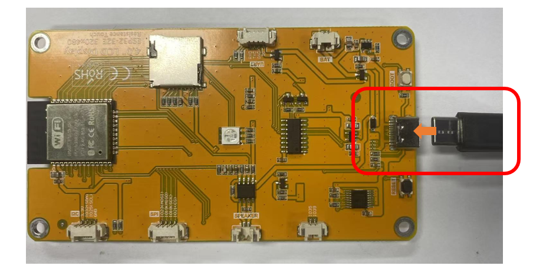

##############################################################################
Chapter 11 TFT Touch Calibration
##############################################################################

Project 11.1 TFT Touch Calibration
*****************************************

Component List 
============================

+----------------------------+----------------+
| Freenove ESP32 Display x 1 | USB cable x1   |
|                            |                |
| |Chapter01_02|             | |Chapter01_03| |
+----------------------------+----------------+
| Stylus x 1                                  |
|                                             |
| |Chapter11_00|                              |
+----------------------------+----------------+

.. |Chapter01_02| image:: ../_static/imgs/1_Serial/Chapter01_02.png
.. |Chapter01_03| image:: ../_static/imgs/1_Serial/Chapter01_03.png
.. |Chapter11_00| image:: ../_static/imgs/11_TFT_Touch_Calibration/Chapter11_00.png

Circuit
==========================

Connect Freenove ESP32 Display to the computer with USB cable.

Sketch
==========================

Open **"Sketch_11.1_TFT_Touch_Calibrate"** folder under **"Freenove_ESP32_Display\\Sketch"** and double-click **"Sketch_11.1_TFT_Touch_Calibrate.ino"**.

The sample code provides two codes for different models of Freenove ESP32 Display. You can upload the corresponding sample code according to the actual model.

Sketch_11.1_TFT_Touch_Calibrate_2.8_Inch
--------------------------------------------------

Install Necessary Libraries
^^^^^^^^^^^^^^^^^^^^^^^^^^^^^^

If your screen is a 2.8-inch one, you also need to install the TFT_Touch library.

Click **Sketch** -> **Include Library** -> **Add .ZIP Library...**

Select "TFT_Touch_v0.3.zip" in the Freenove_ESP32_Display\\Libraries folder and click Open.

The following message indicates the successful installation of the library.

The following is the program code:

.. literalinclude:: ../../../freenove_Kit/Sketches/Sketch_11.1_TFT_Touch_Calibrate_2.8_Inch/Sketch_11.1_TFT_Touch_Calibrate_2.8_Inch.ino
   :linenos:
   :language: c
   :dedent:

Code Explanation
^^^^^^^^^^^^^^^^^^^^^^^^^^^^^^

Include the necessary header files.

.. literalinclude:: ../../../freenove_Kit/Sketches/Sketch_11.1_TFT_Touch_Calibrate_2.8_Inch/Sketch_11.1_TFT_Touch_Calibrate_2.8_Inch.ino
   :linenos:
   :language: c
   :lines: 7-8
   :dedent:

Create TFT object instance.

.. literalinclude:: ../../../freenove_Kit/Sketches/Sketch_11.1_TFT_Touch_Calibrate_2.8_Inch/Sketch_11.1_TFT_Touch_Calibrate_2.8_Inch.ino
   :linenos:
   :language: c
   :lines: 15-15
   :dedent:

Adjust the display direction of the screen.

.. literalinclude:: ../../../freenove_Kit/Sketches/Sketch_11.1_TFT_Touch_Calibrate_2.8_Inch/Sketch_11.1_TFT_Touch_Calibrate_2.8_Inch.ino
   :linenos:
   :language: c
   :lines: 36-36
   :dedent:

Click "Upload" to upload the code to Freenove ESP32 Display, set the baud rate to 115200.

Click the positions of the red cross cursor on the screen in sequence according to the prompts on the display

When the following message appears on the screen, the calibration is complete.

Save the calibration results printed in the serial monitor.

.. note::
    
    :red:`This calibration code only needs to run once during initial setup to obtain screen calibration parameters. After successful calibration, please save the calibration values for future use - no need to repeat this calibration procedure afterward.`

Sketch_11.1_TFT_Touch_Calibrate_3.2_3.5_4.0_Inch
----------------------------------------------------

The following is the program code:

.. literalinclude:: ../../../freenove_Kit/Sketches/Sketch_11.1_TFT_Touch_Calibrate_3.2_3.5_4.0_Inch/Sketch_11.1_TFT_Touch_Calibrate_3.2_3.5_4.0_Inch.ino
   :linenos:
   :language: c
   :dedent:

Code Explanation
^^^^^^^^^^^^^^^^^^^^^^^^^^^^^^

Include necessary header files.

.. literalinclude:: ../../../freenove_Kit/Sketches/Sketch_11.1_TFT_Touch_Calibrate_3.2_3.5_4.0_Inch/Sketch_11.1_TFT_Touch_Calibrate_3.2_3.5_4.0_Inch.ino
   :linenos:
   :language: c
   :lines: 7-8
   :dedent:

Create TFT object instance.

.. literalinclude:: ../../../freenove_Kit/Sketches/Sketch_11.1_TFT_Touch_Calibrate_3.2_3.5_4.0_Inch/Sketch_11.1_TFT_Touch_Calibrate_3.2_3.5_4.0_Inch.ino
   :linenos:
   :language: c
   :lines: 9-9
   :dedent:

Adjust the display direction.

.. literalinclude:: ../../../freenove_Kit/Sketches/Sketch_11.1_TFT_Touch_Calibrate_3.2_3.5_4.0_Inch/Sketch_11.1_TFT_Touch_Calibrate_3.2_3.5_4.0_Inch.ino
   :linenos:
   :language: c
   :lines: 20-20
   :dedent:

Touch calibrate function.

.. literalinclude:: ../../../freenove_Kit/Sketches/Sketch_11.1_TFT_Touch_Calibrate_3.2_3.5_4.0_Inch/Sketch_11.1_TFT_Touch_Calibrate_3.2_3.5_4.0_Inch.ino
   :linenos:
   :language: c
   :lines: 58-58
   :dedent:

Click "Upload" to upload the code to Freenove ESP32 Display and set the baud rate to 115200.

Follow the on-screen instructions and sequentially tap the positions indicated by the purple arrows on the display.

The calibration results will be printed in the Serial Monitor. After calibration, you must save these values, as they will be used in the code implementation in the next section.

:red:`This calibration routine should be executed only once during initial device setup to acquire screen calibration parameters.`