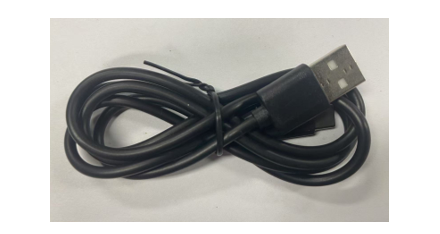

##############################################################################
Chapter 12 TFT Touch Drawing
##############################################################################

After learning this chapter, you will be able to draw freely on the screen.

Project 12.1 TFT Touch Drawing
***********************************

Component List 
=================================

.. table:: 
    :align: center
    :width: 80%
    :class: table-line

    +----------------------------+----------------+
    | Freenove ESP32 Display x 1 | USB cable x1   |
    |                            |                |
    | |Chapter01_02|             | |Chapter01_03| |
    +----------------------------+----------------+
    | Stylus x 1                                  |
    |                                             |
    | |Chapter11_00|                              |
    +----------------------------+----------------+

.. |Chapter01_02| image:: ../_static/imgs/1_Serial/Chapter01_02.png

.. |Chapter11_00| image:: ../_static/imgs/11_TFT_Touch_Calibration/Chapter11_00.png

Circuit
==========================

Connect Freenove ESP32 Display to the computer with USB cable.

.. image:: ../_static/imgs/1_Serial/Chapter01_04.png
    :align: center

Sketch
==========================

Open **"Sketch_12.1_TFT_Touch_Calibrate"** folder under **"Freenove_ESP32_Display\\Sketch"** and double-click **"Sketch_12.1_TFT_Touch_Calibrate.ino"**.

The sample code provides two codes for different models of :ref:`Freenove ESP32 Display <ESP32_Display>`. You can upload the corresponding sample code according to the actual model.

Sketch_12.1_TFT_Touch_Draw_2.8_Inch
-------------------------------------------

The following is the program code:

.. literalinclude:: ../../../freenove_Kit/Sketches/Sketch_12.1_TFT_Touch_Draw_2.8_Inch/Sketch_12.1_TFT_Touch_Draw_2.8_Inch.ino
   :linenos:
   :language: c
   :dedent:

Code Explanation
^^^^^^^^^^^^^^^^^^^^^^^^^^^^^^^^^^

Include the necessary header files.

.. code-block:: c
    :linenos:

    #include <TFT_eSPI.h>  // TFT display library
    ...
    #include <TFT_Touch.h>

Create TFT object instance.

.. literalinclude:: ../../../freenove_Kit/Sketches/Sketch_12.1_TFT_Touch_Draw_2.8_Inch/Sketch_12.1_TFT_Touch_Draw_2.8_Inch.ino
   :linenos:
   :language: c
   :lines: 12-13
   :dedent:

Define screen resolution.

.. literalinclude:: ../../../freenove_Kit/Sketches/Sketch_12.1_TFT_Touch_Draw_2.8_Inch/Sketch_12.1_TFT_Touch_Draw_2.8_Inch.ino
   :linenos:
   :language: c
   :lines: 15-16
   :dedent:

Draw color palette.

.. literalinclude:: ../../../freenove_Kit/Sketches/Sketch_12.1_TFT_Touch_Draw_2.8_Inch/Sketch_12.1_TFT_Touch_Draw_2.8_Inch.ino
   :linenos:
   :language: c
   :lines: 40-43
   :dedent:

Detect whether the screen is pressed.

.. literalinclude:: ../../../freenove_Kit/Sketches/Sketch_12.1_TFT_Touch_Draw_2.8_Inch/Sketch_12.1_TFT_Touch_Draw_2.8_Inch.ino
   :linenos:
   :language: c
   :lines: 82-82
   :dedent:

Store the x and y coordinates of the touch point in variables.

.. literalinclude:: ../../../freenove_Kit/Sketches/Sketch_12.1_TFT_Touch_Draw_2.8_Inch/Sketch_12.1_TFT_Touch_Draw_2.8_Inch.ino
   :linenos:
   :language: c
   :lines: 85-87
   :dedent:

When the Clear button is pressed, fill the screen with the current color.

.. literalinclude:: ../../../freenove_Kit/Sketches/Sketch_12.1_TFT_Touch_Draw_2.8_Inch/Sketch_12.1_TFT_Touch_Draw_2.8_Inch.ino
   :linenos:
   :language: c
   :lines: 99-103
   :dedent:

Calculate the selected color based on the coordinates of the touch point

.. literalinclude:: ../../../freenove_Kit/Sketches/Sketch_12.1_TFT_Touch_Draw_2.8_Inch/Sketch_12.1_TFT_Touch_Draw_2.8_Inch.ino
   :linenos:
   :language: c
   :lines: 104-111
   :dedent:

Draw a line based on coordinates

.. literalinclude:: ../../../freenove_Kit/Sketches/Sketch_12.1_TFT_Touch_Draw_2.8_Inch/Sketch_12.1_TFT_Touch_Draw_2.8_Inch.ino
   :linenos:
   :language: c
   :lines: 116-130
   :dedent:

Add the calibration values obtained in the previous section to the code.

Sketch_12.2_TFT_Touch_Draw_3.2_Inch
-------------------------------------------

The following is the program code:

.. literalinclude:: ../../../freenove_Kit/Sketches/Sketch_12.2_TFT_Touch_Draw_3.2_Inch/Sketch_12.2_TFT_Touch_Draw_3.2_Inch.ino
   :linenos:
   :language: c
   :dedent:

Code Explanation
^^^^^^^^^^^^^^^^^^^^^^^^^^^^^^^^^^

Include the necessary library.

.. literalinclude:: ../../../freenove_Kit/Sketches/Sketch_12.2_TFT_Touch_Draw_3.2_Inch/Sketch_12.2_TFT_Touch_Draw_3.2_Inch.ino
   :linenos:
   :language: c
   :lines: 7-7
   :dedent:

Create TFT object instance.

.. literalinclude:: ../../../freenove_Kit/Sketches/Sketch_12.2_TFT_Touch_Draw_3.2_Inch/Sketch_12.2_TFT_Touch_Draw_3.2_Inch.ino
   :linenos:
   :language: c
   :lines: 12-12
   :dedent:

Define screen resolution.

.. literalinclude:: ../../../freenove_Kit/Sketches/Sketch_12.2_TFT_Touch_Draw_3.2_Inch/Sketch_12.2_TFT_Touch_Draw_3.2_Inch.ino
   :linenos:
   :language: c
   :lines: 9-10
   :dedent:

Apply the calibration data.

.. code-block:: c
    :linenos:

    uint16_t calData[5] = { 412, 3502, 262, 3596, 3 };
    tft.setTouch(calData);

Draw color palette.

.. literalinclude:: ../../../freenove_Kit/Sketches/Sketch_12.2_TFT_Touch_Draw_3.2_Inch/Sketch_12.2_TFT_Touch_Draw_3.2_Inch.ino
   :linenos:
   :language: c
   :lines: 28-31
   :dedent:

Detect whether the touch screen is pressed and store the x and y coordinates of the touch point in variables.

.. literalinclude:: ../../../freenove_Kit/Sketches/Sketch_12.2_TFT_Touch_Draw_3.2_Inch/Sketch_12.2_TFT_Touch_Draw_3.2_Inch.ino
   :linenos:
   :language: c
   :lines: 57-57
   :dedent:

When the Clear button is pressed, fill the screen with the current color.

.. literalinclude:: ../../../freenove_Kit/Sketches/Sketch_12.2_TFT_Touch_Draw_3.2_Inch/Sketch_12.2_TFT_Touch_Draw_3.2_Inch.ino
   :linenos:
   :language: c
   :lines: 70-74
   :dedent:

Calculate the selected color based on the coordinates of the touch point

.. literalinclude:: ../../../freenove_Kit/Sketches/Sketch_12.2_TFT_Touch_Draw_3.2_Inch/Sketch_12.2_TFT_Touch_Draw_3.2_Inch.ino
   :linenos:
   :language: c
   :lines: 75-82
   :dedent:

Draw a line based on coordinates

.. literalinclude:: ../../../freenove_Kit/Sketches/Sketch_12.2_TFT_Touch_Draw_3.2_Inch/Sketch_12.2_TFT_Touch_Draw_3.2_Inch.ino
   :linenos:
   :language: c
   :lines: 87-101
   :dedent:

Add the calibration value obtained from the previous section to the code.

Click "Upload" to upload the code to Freenove ESP32 Display. Set the baud rate to 115200.

Sketch_12.3_TFT_Touch_Draw_3.5_4.0_Inch
----------------------------------------------

The following is the program code:

.. literalinclude:: ../../../freenove_Kit/Sketches/Sketch_12.3_TFT_Touch_Draw_3.5_4.0_Inch/Sketch_12.3_TFT_Touch_Draw_3.5_4.0_Inch.ino
   :linenos:
   :language: c
   :dedent:

Code Explanation
^^^^^^^^^^^^^^^^^^^^^^^^^^^^^^^^^^^^^^

Include the necessary header file.

.. literalinclude:: ../../../freenove_Kit/Sketches/Sketch_12.3_TFT_Touch_Draw_3.5_4.0_Inch/Sketch_12.3_TFT_Touch_Draw_3.5_4.0_Inch.ino
   :linenos:
   :language: c
   :lines: 7-7
   :dedent:

Define screen resolution.

.. literalinclude:: ../../../freenove_Kit/Sketches/Sketch_12.3_TFT_Touch_Draw_3.5_4.0_Inch/Sketch_12.3_TFT_Touch_Draw_3.5_4.0_Inch.ino
   :linenos:
   :language: c
   :lines: 9-10
   :dedent:

Create TFT object instance.

.. literalinclude:: ../../../freenove_Kit/Sketches/Sketch_12.3_TFT_Touch_Draw_3.5_4.0_Inch/Sketch_12.3_TFT_Touch_Draw_3.5_4.0_Inch.ino
   :linenos:
   :language: c
   :lines: 12-12
   :dedent:

Apply the calibration data.

.. literalinclude:: ../../../freenove_Kit/Sketches/Sketch_12.3_TFT_Touch_Draw_3.5_4.0_Inch/Sketch_12.3_TFT_Touch_Draw_3.5_4.0_Inch.ino
   :linenos:
   :language: c
   :lines: 50-51
   :dedent:

Draw color palette.

.. literalinclude:: ../../../freenove_Kit/Sketches/Sketch_12.3_TFT_Touch_Draw_3.5_4.0_Inch/Sketch_12.3_TFT_Touch_Draw_3.5_4.0_Inch.ino
   :linenos:
   :language: c
   :lines: 28-31
   :dedent:

Detect whether the touch screen is pressed and store the x and y coordinates of the touch point in variables.

.. literalinclude:: ../../../freenove_Kit/Sketches/Sketch_12.3_TFT_Touch_Draw_3.5_4.0_Inch/Sketch_12.3_TFT_Touch_Draw_3.5_4.0_Inch.ino
   :linenos:
   :language: c
   :lines: 59-59
   :dedent:

When the Clear button is pressed, fill the screen with the current color.

.. literalinclude:: ../../../freenove_Kit/Sketches/Sketch_12.3_TFT_Touch_Draw_3.5_4.0_Inch/Sketch_12.3_TFT_Touch_Draw_3.5_4.0_Inch.ino
   :linenos:
   :language: c
   :lines: 72-76
   :dedent:

Calculate the selected color based on the coordinates of the touch point

.. literalinclude:: ../../../freenove_Kit/Sketches/Sketch_12.3_TFT_Touch_Draw_3.5_4.0_Inch/Sketch_12.3_TFT_Touch_Draw_3.5_4.0_Inch.ino
   :linenos:
   :language: c
   :lines: 77-84
   :dedent:

Draw a line based on coordinates

.. literalinclude:: ../../../freenove_Kit/Sketches/Sketch_12.3_TFT_Touch_Draw_3.5_4.0_Inch/Sketch_12.3_TFT_Touch_Draw_3.5_4.0_Inch.ino
   :linenos:
   :language: c
   :lines: 89-103
   :dedent:

Add the calibration values obtained from the previous section to the code.

Click "Upload" to upload the code to Freenove ESP32 Display. Set the baud rate to 115200.

Reference
-------------------------------------

.. py:function:: void fillRect(int16_t x, int16_t y, int16_t w, int16_t h, uint16_t color);	

    This function is used to draw a solid rectangle

    **Parameters:**

    x: x coordinate of the upper left corner of the solid rectangle

    y: y coordinate of the upper left corner of the solid rectangle

    w: width of the solid rectangle

    h: height of the solid rectangle

    color: fill color of the solid rectangle

.. py:function:: void drawWideLine(int16_t x0, int16_t y0, int16_t x1, int16_t y1, uint16_t width, uint16_t color1, uint16_t color2);	

    This function is used to draw lines

    **Parameters:**

    x0: x coordinate of the starting point of the line

    y0: y coordinate of the starting point of the line

    x1: x coordinate of the end point of the line

    y1: y coordinate of the end point of the line

    width: width of the line

    color1: line color

    color2: anti-aliasing transition color

Tips: Aliasing & Anti-aliasing

In computer graphics, **aliasing** refers to the **jagged or stair-step appearance** of lines and curves in digital images, particularly noticeable on diagonal lines and edges. This occurs due to the discrete nature of pixel grids - screens compose images from tiny square pixels that cannot perfectly represent continuous geometry.

**Anti-aliasing** mitigates these artifacts through technical means to **smooth edges**, achieving more natural-looking graphics. The core technique blends transitional colors at boundary pixels, simulating human visual perception of soft edges.