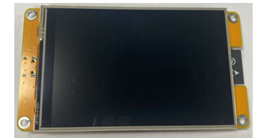

##############################################################################
Chapter 15 LVGL Timer
##############################################################################

Project 15.1 LVGL Timer
******************************

Component List 
============================

.. table:: 
    :align: center
    :width: 80%
    :class: table-line

    +----------------------------+----------------+
    | Freenove ESP32 Display x 1 | USB cable x1   |
    |                            |                |
    | |Chapter01_02|             | |Chapter01_03| |
    +----------------------------+----------------+
    | Stylus x 1                                  |
    |                                             |
    | |Chapter11_00|                              |
    +---------------------------------------------+

.. |Chapter01_03| image:: ../_static/imgs/1_Serial/Chapter01_03.png
.. |Chapter11_00| image:: ../_static/imgs/11_TFT_Touch_Calibration/Chapter11_00.png

Circuit
==========================

Connect Freenove ESP32 Display to the computer with USB cable.

.. image:: ../_static/imgs/1_Serial/Chapter01_04.png
    :align: center

Sketch
==========================

Open **“Sketch_15.1_Lvgl_Timer”** folder under **“Freenove_ESP32_Display\\Sketch”** and double-click “Sketch_15.1_Lvgl_Timer.ino”.

Sketch_15.1_Lvgl_Timer
--------------------------

The following is the program code:

.. literalinclude:: ../../../freenove_Kit/Sketches/Sketch_15.1_Lvgl_Timer/Sketch_15.1_Lvgl_Timer.ino
   :linenos:
   :language: c
   :dedent:

Code Explanation
---------------------------

Include the header files.

.. literalinclude:: ../../../freenove_Kit/Sketches/Sketch_15.1_Lvgl_Timer/Sketch_15.1_Lvgl_Timer.ino
   :linenos:
   :language: c
   :lines: 7-8
   :dedent:

Set the baud rate to 115200.

.. literalinclude:: ../../../freenove_Kit/Sketches/Sketch_15.1_Lvgl_Timer/Sketch_15.1_Lvgl_Timer.ino
   :linenos:
   :language: c
   :lines: 12-12
   :dedent:

Initialize configuration.

.. literalinclude:: ../../../freenove_Kit/Sketches/Sketch_15.1_Lvgl_Timer/Sketch_15.1_Lvgl_Timer.ino
   :linenos:
   :language: c
   :lines: 15-15
   :dedent:

Create and load the interface.

.. literalinclude:: ../../../freenove_Kit/Sketches/Sketch_15.1_Lvgl_Timer/Sketch_15.1_Lvgl_Timer.ino
   :linenos:
   :language: c
   :lines: 25-26
   :dedent:

LVGL task processor.

.. literalinclude:: ../../../freenove_Kit/Sketches/Sketch_15.1_Lvgl_Timer/Sketch_15.1_Lvgl_Timer.ino
   :linenos:
   :language: c
   :lines: 30-30
   :dedent:

Click **“Upload”** to upload the code to Freenove ESP32 Display. Set the baud rate to 115200.

