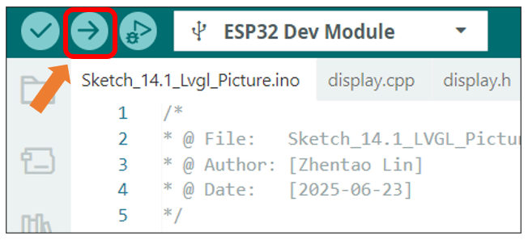
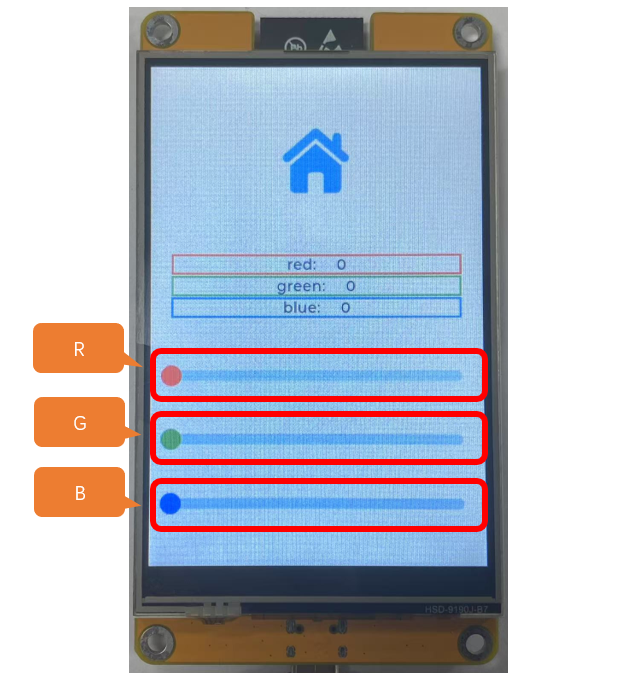
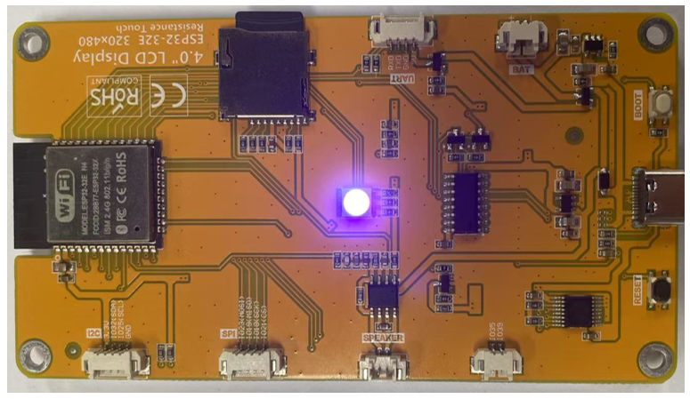

##############################################################################
Chapter 16 Lvgl RGB
##############################################################################

Project 16.1 LVGL RGB
*********************************

Component List 
=============================

+----------------------------+----------------+
| Freenove ESP32 Display x 1 | USB cable x1   |
|                            |                |
| |Chapter01_02|             | |Chapter01_03| |
+----------------------------+----------------+
| Stylus x 1                                  |
|                                             |
| |Chapter11_00|                              |
+----------------------------+----------------+

.. |Chapter01_02| image:: ../_static/imgs/1_Serial/Chapter01_02.png
.. |Chapter01_03| image:: ../_static/imgs/1_Serial/Chapter01_03.png
.. |Chapter11_00| image:: ../_static/imgs/11_TFT_Touch_Calibration/Chapter11_00.png

Circuit
==========================

Connect Freenove ESP32 Display to the computer with USB cable.

.. image:: ../_static/imgs/1_Serial/Chapter01_04.png
    :align: center

Sketch
==========================

Open **“Sketch_16.1_Lvgl_RGB”** folder under **“Freenove_ESP32_Display\\Sketch”** and double-click **“Sketch_16.1_Lvgl_RGB.ino”**.

Sketch_16.1_Lvgl_RGB
--------------------------

The following is the program code:

.. literalinclude:: ../../../freenove_Kit/Sketches/Sketch_16.1_Lvgl_RGB/Sketch_16.1_Lvgl_RGB.ino
   :linenos:
   :language: c
   :dedent:

Code Explanation
---------------------------

Include the header files.

.. literalinclude:: ../../../freenove_Kit/Sketches/Sketch_16.1_Lvgl_RGB/Sketch_16.1_Lvgl_RGB.ino
   :linenos:
   :language: c
   :lines: 7-8
   :dedent:

Define the pins.

.. literalinclude:: ../../../freenove_Kit/Sketches/Sketch_16.1_Lvgl_RGB/Sketch_16.1_Lvgl_RGB.ino
   :linenos:
   :language: c
   :lines: 10-12
   :dedent:

Set the baud rate to 115200

.. literalinclude:: ../../../freenove_Kit/Sketches/Sketch_16.1_Lvgl_RGB/Sketch_16.1_Lvgl_RGB.ino
   :linenos:
   :language: c
   :lines: 16-16
   :dedent:

Initialize the RGB LED.

.. literalinclude:: ../../../freenove_Kit/Sketches/Sketch_16.1_Lvgl_RGB/Sketch_16.1_Lvgl_RGB.ino
   :linenos:
   :language: c
   :lines: 29-30
   :dedent:

Create and load the interface.

.. literalinclude:: ../../../freenove_Kit/Sketches/Sketch_16.1_Lvgl_RGB/Sketch_16.1_Lvgl_RGB.ino
   :linenos:
   :language: c
   :lines: 31-32
   :dedent:

LVGL task processor.

.. literalinclude:: ../../../freenove_Kit/Sketches/Sketch_16.1_Lvgl_RGB/Sketch_16.1_Lvgl_RGB.ino
   :linenos:
   :language: c
   :lines: 36-36
   :dedent:

Click “Upload” to upload the code to Freenove ESP32 Display. Set the baud rate to 115200.

Drag to adjust the value of the red (R), green (G), and blue (B) color, and you will see the color of the LED change.

