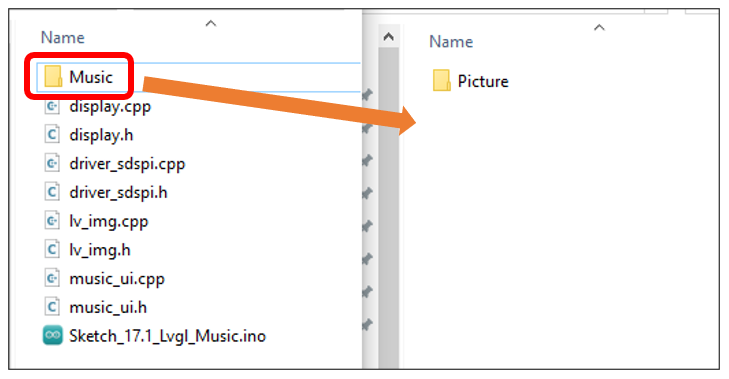
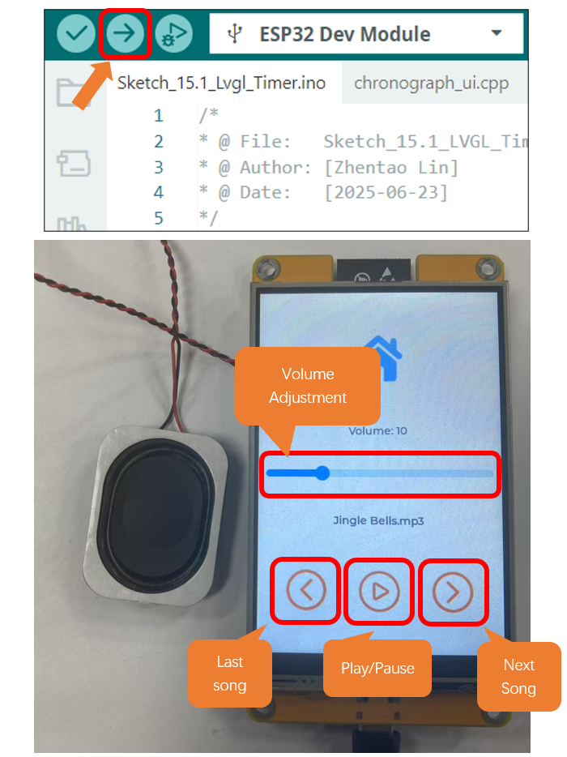

##############################################################################
Chapter 17 LVGL Music
##############################################################################

Project 17.1 LVGL Music
*****************************

Component List 
=============================

+----------------------------+----------------+
| Freenove ESP32 Display x 1 | USB cable x1   |
|                            |                |
| |Chapter01_02|             | |Chapter01_03| |
+----------------------------+----------------+
| Stylus x 1                                  |
|                                             |
| |Chapter11_00|                              |
+----------------------------+----------------+

.. |Chapter01_02| image:: ../_static/imgs/1_Serial/Chapter01_02.png
.. |Chapter01_03| image:: ../_static/imgs/1_Serial/Chapter01_03.png
.. |Chapter11_00| image:: ../_static/imgs/11_TFT_Touch_Calibration/Chapter11_00.png

.. note::
    
    :red:`This kit does not include speaker, SD card, or SD card reader. Please buy them yourself!`

Circuit
==========================

Before connecting the USB cable, insert the SD card into the SD card slot on the back of the ESP32-S3.

.. image:: ../_static/imgs/7_Play_MP3/Chapter07_00.png
    :align: center

Connect Freenove ESP32-S3 to the computer using the USB cable.

.. image:: ../_static/imgs/7_Play_MP3/Chapter07_02.png
    :align: center

Sketch
==========================

Open **“Sketch_17.1_Lvgl_Music”** folder under **“Freenove_ESP32_Display\\Sketch”** and double-click **“Sketch_17.1_Lvgl_Music.ino”**.

Sketch_17.1_Lvgl_Music
----------------------------------

The following is the program code:

.. literalinclude:: ../../../freenove_Kit/Sketches/Sketch_17.1_Lvgl_Music/Sketch_17.1_Lvgl_Music.ino
   :linenos:
   :language: c
   :dedent:

Code Explanation
------------------------------------

Include the header files.

.. literalinclude:: ../../../freenove_Kit/Sketches/Sketch_17.1_Lvgl_Music/Sketch_17.1_Lvgl_Music.ino
   :linenos:
   :language: c
   :lines: 7-9
   :dedent:

Define the pins.

.. literalinclude:: ../../../freenove_Kit/Sketches/Sketch_17.1_Lvgl_Music/Sketch_17.1_Lvgl_Music.ino
   :linenos:
   :language: c
   :lines: 13-17
   :dedent:

Set the baud rate to 115200

.. literalinclude:: ../../../freenove_Kit/Sketches/Sketch_17.1_Lvgl_Music/Sketch_17.1_Lvgl_Music.ino
   :linenos:
   :language: c
   :lines: 13-17
   :dedent:

Initialize configuration.

.. literalinclude:: ../../../freenove_Kit/Sketches/Sketch_17.1_Lvgl_Music/Sketch_17.1_Lvgl_Music.ino
   :linenos:
   :language: c
   :lines: 28-28
   :dedent:

Create and load the interface.

.. literalinclude:: ../../../freenove_Kit/Sketches/Sketch_17.1_Lvgl_Music/Sketch_17.1_Lvgl_Music.ino
   :linenos:
   :language: c
   :lines: 35-36
   :dedent:

LVGL task processor.

.. literalinclude:: ../../../freenove_Kit/Sketches/Sketch_17.1_Lvgl_Music/Sketch_17.1_Lvgl_Music.ino
   :linenos:
   :language: c
   :lines: 42-42
   :dedent:

Insert the SD card to the card reader and plug them to the computer. Copy the **Music** folder under the **Freenove_ESP32_Display\\Sketch\\Sketch_17.1_Lvgl_Music** directory to the root directory of the SD card.

Click **“Upload”** to upload the code to Freenove ESP32 Display. Set the baud rate to 115200.

.. note::
    
    :red:`If the screen flickers during playback, it may be due to insufficient power supply. You can try powering with a battery.`

