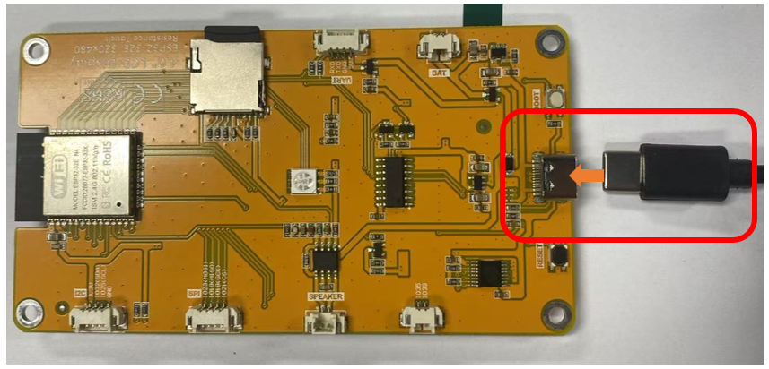

##############################################################################
Chapter 18 LVGL Multifunctionality
##############################################################################

Project 18.1 LVGL Multifunctionality
*********************************************

Component List 
=============================

.. table:: 
    :align: center
    :width: 80%
    :class: table-line

    +----------------------------+----------------+
    | Freenove ESP32 Display x 1 | USB cable x1   |
    |                            |                |
    | |Chapter01_02|             | |Chapter01_03| |
    +----------------------------+----------------+
    | Stylus x 1                                  |
    |                                             |
    | |Chapter11_00|                              |
    +----------------------------+----------------+

.. |Chapter01_02| image:: ../_static/imgs/1_Serial/Chapter01_02.png
.. |Chapter01_03| image:: ../_static/imgs/1_Serial/Chapter01_03.png
.. |Chapter11_00| image:: ../_static/imgs/11_TFT_Touch_Calibration/Chapter11_00.png

Circuit
=============================

Before connecting the USB cable, insert the SD card into the SD card slot on the back of the ESP32-S3.

.. image:: ../_static/imgs/7_Play_MP3/Chapter07_00.png
    :align: center

Connect Freenove ESP32-S3 to the computer using the USB cable.

Sketch
=============================

Open **“Sketch_18.1_Lvgl_Multifunctionality”** folder under **“Freenove_ESP32_Display\\Sketch”** and double-click **“Sketch_18.1_Lvgl_Multifunctionality.ino”**.

Sketch_18.1_Lvgl_Multifunctionality
----------------------------------------

The following is the program code:

.. literalinclude:: ../../../freenove_Kit/Sketches/Sketch_18.1_Lvgl_Multifunctionality/Sketch_18.1_Lvgl_Multifunctionality.ino
   :linenos:
   :language: c
   :dedent:

Code Explanation
-----------------------------------

Include the header files.

.. literalinclude:: ../../../freenove_Kit/Sketches/Sketch_18.1_Lvgl_Multifunctionality/Sketch_18.1_Lvgl_Multifunctionality.ino
   :linenos:
   :language: c
   :lines: 7-9
   :dedent:

Define the pins.

.. literalinclude:: ../../../freenove_Kit/Sketches/Sketch_18.1_Lvgl_Multifunctionality/Sketch_18.1_Lvgl_Multifunctionality.ino
   :linenos:
   :language: c
   :lines: 11-18
   :dedent:

Set the baud rate to 115200

.. literalinclude:: ../../../freenove_Kit/Sketches/Sketch_18.1_Lvgl_Multifunctionality/Sketch_18.1_Lvgl_Multifunctionality.ino
   :linenos:
   :language: c
   :lines: 24-24
   :dedent:

Initialize RGB LED configuration

.. literalinclude:: ../../../freenove_Kit/Sketches/Sketch_18.1_Lvgl_Multifunctionality/Sketch_18.1_Lvgl_Multifunctionality.ino
   :linenos:
   :language: c
   :lines: 31-32
   :dedent:

Initialize SD card.

.. literalinclude:: ../../../freenove_Kit/Sketches/Sketch_18.1_Lvgl_Multifunctionality/Sketch_18.1_Lvgl_Multifunctionality.ino
   :linenos:
   :language: c
   :lines: 33-33
   :dedent:

Initialize the screen.

.. literalinclude:: ../../../freenove_Kit/Sketches/Sketch_18.1_Lvgl_Multifunctionality/Sketch_18.1_Lvgl_Multifunctionality.ino
   :linenos:
   :language: c
   :lines: 34-34
   :dedent:

Create and load the interface.

.. literalinclude:: ../../../freenove_Kit/Sketches/Sketch_18.1_Lvgl_Multifunctionality/Sketch_18.1_Lvgl_Multifunctionality.ino
   :linenos:
   :language: c
   :lines: 41-42
   :dedent:

LVGL task processor.

.. literalinclude:: ../../../freenove_Kit/Sketches/Sketch_18.1_Lvgl_Multifunctionality/Sketch_18.1_Lvgl_Multifunctionality.ino
   :linenos:
   :language: c
   :lines: 49-49
   :dedent:

Click **“Upload”** to upload the code to Freenove ESP32 Display. Set the baud rate to 115200.

