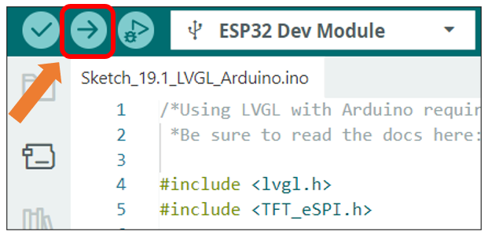
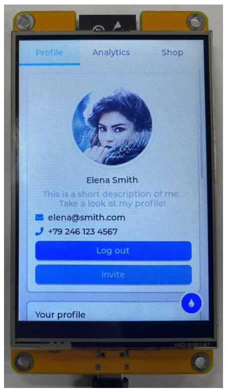

##############################################################################
Chapter 19 LVGL Arduino
##############################################################################

Project 19.1 LVGL Arduino
***********************************

Component List 
============================

+----------------------------+----------------+
| Freenove ESP32 Display x 1 | USB cable x1   |
|                            |                |
| |Chapter01_02|             | |Chapter01_03| |
+----------------------------+----------------+
| Stylus x 1                                  |
|                                             |
| |Chapter11_00|                              |
+----------------------------+----------------+

.. |Chapter01_02| image:: ../_static/imgs/1_Serial/Chapter01_02.png
.. |Chapter01_03| image:: ../_static/imgs/1_Serial/Chapter01_03.png
.. |Chapter11_00| image:: ../_static/imgs/11_TFT_Touch_Calibration/Chapter11_00.png

Circuit
=============================

Connect Freenove ESP32 Display to the computer with USB cable.

.. image:: ../_static/imgs/1_Serial/Chapter01_04.png
    :align: center

Sketch
============================

Open **“Sketch_19.1_Lvgl_Arduino”** folder under “Freenove_ESP32_Display\\Sketch” and double-click “Sketch_19.1_Lvgl_Arduino.ino”.

Sketch_19.1_Lvgl_Arduino
----------------------------------------

The following is the program code:

.. literalinclude:: ../../../freenove_Kit/Sketches/Sketch_19.1_LVGL_Arduino/Sketch_19.1_LVGL_Arduino.ino
   :linenos:
   :language: c
   :dedent:

Click “Upload” to upload the code to Freenove ESP32 Display

