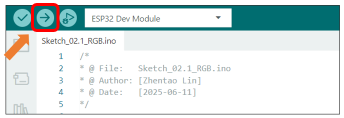

##############################################################################
Chapter 2 RGB
##############################################################################

Project 2.1 RGB
************************

Related Knowledge
===========================

Red, green, and blue are called the three primary colors. When you combine these three primary colors of different brightness, it can produce almost all kinds of visible light. 

The onboard RGB LED can emit three basic colors of red, green and blue, and supports 256-level brightness adjustment, which means that it can emit 2^24=16,777,216 different colors.

Component List 
=======================

+----------------------------+----------------+
| Freenove ESP32 Display x 1 | USB cable x1   |
|                            |                |
| |Chapter01_02|             | |Chapter01_03| |
+----------------------------+----------------+

.. |Chapter01_02| image:: ../_static/imgs/1_Serial/Chapter01_02.png
.. |Chapter01_03| image:: ../_static/imgs/1_Serial/Chapter01_03.png

Circuit
========================

Connect Freenove ESP32 Display to the computer with USB cable. 

.. image:: ../_static/imgs/1_Serial/Chapter01_04.png
    :align: center

Sketch
========================

Open **"Sketch_02.1_RGB"** folder under **"Freenove_ESP32_Display\\Sketch"** and double-click **"Sketch_02.1_RGB.ino"**.

Sketch_02.1_RGB
------------------------

The following is the program code:

.. literalinclude:: ../../../freenove_Kit/Sketches/Sketch_02.1_RGB/Sketch_02.1_RGB.ino
   :linenos:
   :language: c
   :dedent:

Code Explanation
--------------------------

Define the pins for the RGB LED.

.. literalinclude:: ../../../freenove_Kit/Sketches/Sketch_02.1_RGB/Sketch_02.1_RGB.ino
   :linenos:
   :language: c
   :lines: 8-10
   :dedent:

Initialize the LED.

.. literalinclude:: ../../../freenove_Kit/Sketches/Sketch_02.1_RGB/Sketch_02.1_RGB.ino
   :linenos:
   :language: c
   :lines: 25-25
   :dedent:

Change the color of the RGB LED continuously with a cycle period of 500ms.

.. literalinclude:: ../../../freenove_Kit/Sketches/Sketch_02.1_RGB/Sketch_02.1_RGB.ino
   :linenos:
   :language: c
   :lines: 29-36
   :dedent:

Click "Upload" to upload the code to Freenove_ESP32_Display.

The RGB LEDs will cycle through Red -> Green -> Blue -> OFF every 500ms after code upload.

Reference
-----------------------

.. py:function:: void setRGB(bool redLevel, bool greenLevel, bool blueLevel)

    This function controls the RGB light to display different colors.

    Parameters:

    redLevel: When set to 1, the red light turns on; when 0, it turns off.
    
    greenLevel: When set to 1, the green light turns on; when 0, it turns off.
    
    blueLevel: When set to 1, the blue light turns on; when 0, it turns off.

Project 2.2 PWM RGB
**************************

Related Knowledge
==========================

Analog & Digital
--------------------------

An Analog Signal is a continuous signal in both time and value. On the contrary, a Digital Signal or discrete - time signal is a time series consisting of a sequence of quantities. Most signals in life are analog signals. A familiar example of an Analog Signal would be how the temperature throughout the day is continuously changing and could not suddenly change instantaneously from 0℃ to 10℃. However, Digital Signals can instantaneously change in value. This change is expressed in numbers as 1 and 0 (the basis of binary code).   Their differences can more easily be seen when compared when graphed as below.

In practical application, we often use binary as the digital signal, which is a series of 0's and 1's. Since a binary signal only has two values (0 or 1), it has great stability and reliability. Lastly, both analog and digital signals can be converted into the other.

PWM
-----------------------

PWM, Pulse Width Modulation, uses digital pins to send certain frequencies of square waves, that is, the output of high levels and low levels, which alternately last for a while. The total time for each set of high levels and low levels is generally fixed, which is called the period (the reciprocal of the period is frequency). The time of high level outputs are generally called "pulse width", and the duty cycle is the percentage of the ratio of pulse duration, or pulse width (PW) to the total period (T) of the waveform.

The longer the output of high levels last, the larger the duty cycle and the higher the corresponding voltage in analog signal will be. The following figures show how the analogs signal voltage vary between 0V-5V (high level is 5V) corresponding to the pulse width 0%-100%:

Component List 
=======================

+----------------------------+----------------+
| Freenove ESP32 Display x 1 | USB cable x1   |
|                            |                |
| |Chapter01_02|             | |Chapter01_03| |
+----------------------------+----------------+

Circuit
========================

Connect Freenove ESP32 Display to the computer with USB cable. 

.. image:: ../_static/imgs/1_Serial/Chapter01_04.png
    :align: center

Sketch
=======================

Open "Sketch_02.2_PWM_RGB" folder under "Freenove_ESP32_Display\\Sketch" and double-click "Sketch_02.2_PWM_RGB.ino".

Sketch_02.2_PWM_RGB
----------------------------

The following is the program code:

.. literalinclude:: ../../../freenove_Kit/Sketches/Sketch_02.2_PWM_RGB/Sketch_02.2_PWM_RGB.ino
   :linenos:
   :language: c
   :dedent:

Code Explanation
---------------------------

Write a PWM initialization function to configure the pins controlling the RGB lights as PWM output mode.

.. literalinclude:: ../../../freenove_Kit/Sketches/Sketch_02.2_PWM_RGB/Sketch_02.2_PWM_RGB.ino
   :linenos:
   :language: c
   :lines: 34-34
   :dedent:

Use a "for" loop to create a smooth breathing light effect on the RGB LED.

.. literalinclude:: ../../../freenove_Kit/Sketches/Sketch_02.2_PWM_RGB/Sketch_02.2_PWM_RGB.ino
   :linenos:
   :language: c
   :lines: 38-63
   :dedent:

This code achieves the function of printing data on serial monitor. Click "Upload" to upload the code to Freenove_ESP32_Display.

After uploading the code, the RGB LED produces a smooth breathing effect, gradually increasing in brightness while cycling through colors in the sequence: red → green → blue → off (repeat).

Reference
-----------------------------

.. py:function:: bool ledcAttachChannel(uint8_t pin, uint32_t freq, uint8_t resolution, uint8_t channel);	
    
    This function binds the specified PWM channel to a GPIO pin and configures the frequency and resolution of the PWM signal.

    **Parameters:**

    pin: GPIO pin number to bind

    freq: PWM signal frequency in Hz

    resolution: Bit depth for PWM duty cycle resolution (range: 1-16 bits). 

                For example, 8 represents 2^8 (0~255) levels.

    channel: PWM channel number to assign (integer)

.. py:function:: void ledcWrite(uint8_t channel, uint32_t duty);

    This function sets the duty cycle for a specified PWM channel to control output signal intensity.

    **Parameters:**

    channel: PWM channel number
    
    duty: Duty cycle value (range determined by resolution bit depth)