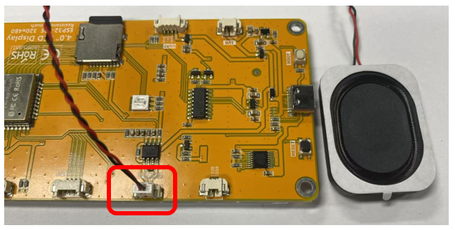
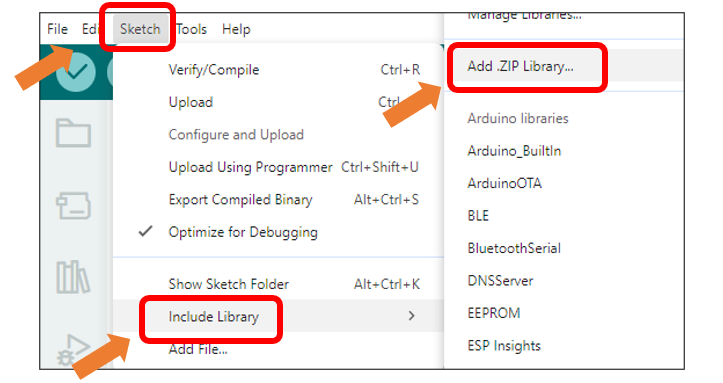
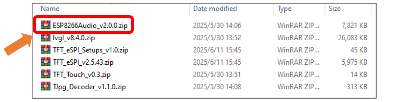
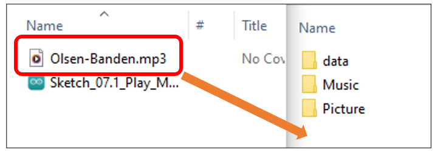
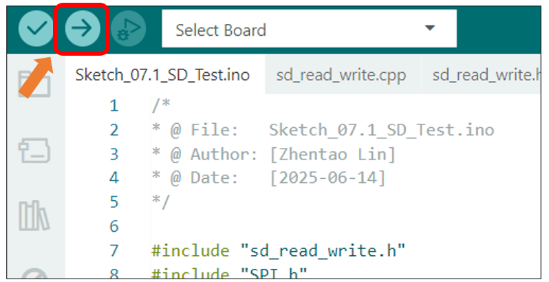

##############################################################################
Chapter 7 Play MP3
##############################################################################

Project 7.1 Play MP3 SD by DAC
**************************************

Component List 
=========================

+----------------------------+----------------+
| Freenove ESP32 Display x 1 | USB cable x1   |
|                            |                |
| |Chapter01_02|             | |Chapter01_03| |
+----------------------------+----------------+

.. |Chapter01_02| image:: ../_static/imgs/1_Serial/Chapter01_02.png
.. |Chapter01_03| image:: ../_static/imgs/1_Serial/Chapter01_03.png

:red:`This product does not include speaker, SD card, and SD card reader, please buy them by yourself. For more information, please refer to` :ref:`Speaker`, :ref:`SD_card` :red:`sections.`

Circuit
========================

Before connecting the USB cable, insert the SD card into the SD card slot on the back of the ESP32-S3.

.. image:: ../_static/imgs/7_Play_MP3/Chapter07_00.png
    :align: center

Connect the speaker.

Connect Freenove ESP32-S3 to the computer using the USB cable.

.. image:: ../_static/imgs/7_Play_MP3/Chapter07_02.png
    :align: center

Sketch
========================

Install the needed libraries.

Click **Sketch** -> **Include Library** -> **Add .ZIP Library...**

Select ESP8266Audio_v2.0.0.zip

Next, we download the code to Freenove_ESP32_Display to test. Open"Sketch_07.1_Play_MP3_SD_by_DAC" folder under "Freenove_ESP32_Display\Sketch" and double-click "Sketch_07.1_Play_MP3_SD_by_DAC.ino".

Sketch_07.1_Play_MP3_SD_by_DAC 
---------------------------------------

The following is the program code:

.. literalinclude:: ../../../freenove_Kit/Sketches/Sketch_07.1_Play_MP3_SD_by_DAC/Sketch_07.1_Play_MP3_SD_by_DAC.ino
   :linenos:
   :language: c
   :dedent:

Code Explanation
-----------------------------

Include necessary header files.

.. literalinclude:: ../../../freenove_Kit/Sketches/Sketch_07.1_Play_MP3_SD_by_DAC/Sketch_07.1_Play_MP3_SD_by_DAC.ino
   :linenos:
   :language: c
   :lines: 7-12
   :dedent:

Define the pins.

.. literalinclude:: ../../../freenove_Kit/Sketches/Sketch_07.1_Play_MP3_SD_by_DAC/Sketch_07.1_Play_MP3_SD_by_DAC.ino
   :linenos:
   :language: c
   :lines: 14-18
   :dedent:

Declare audio objects.

.. literalinclude:: ../../../freenove_Kit/Sketches/Sketch_07.1_Play_MP3_SD_by_DAC/Sketch_07.1_Play_MP3_SD_by_DAC.ino
   :linenos:
   :language: c
   :lines: 20-23
   :dedent:

Set the baud rate to 115200

.. literalinclude:: ../../../freenove_Kit/Sketches/Sketch_07.1_Play_MP3_SD_by_DAC/Sketch_07.1_Play_MP3_SD_by_DAC.ino
   :linenos:
   :language: c
   :lines: 37-37
   :dedent:

Initialize MP3 decoder and play the music. To play other music, please change the name in the code.

.. literalinclude:: ../../../freenove_Kit/Sketches/Sketch_07.1_Play_MP3_SD_by_DAC/Sketch_07.1_Play_MP3_SD_by_DAC.ino
   :linenos:
   :language: c
   :lines: 49-49
   :dedent:

Read audio data and play it.

.. literalinclude:: ../../../freenove_Kit/Sketches/Sketch_07.1_Play_MP3_SD_by_DAC/Sketch_07.1_Play_MP3_SD_by_DAC.ino
   :linenos:
   :language: c
   :lines: 52-56
   :dedent:

:red:`This product does not include speaker, SD card, and SD card reader, please buy them by yourself. For more information, please refer to`` :ref:`Speaker <Speaker>`, :ref:`SD card <SD_card>` :red:`sections.`

Before uploading the code, copy the music to the root directory of the SD card with the SD card reader.

Click "Upload" to upload the code to Freenove ESP32 Display.

The speaker plays the music in the SD card.