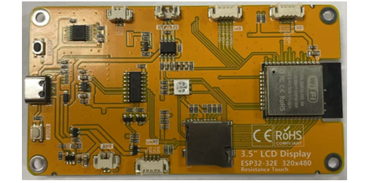
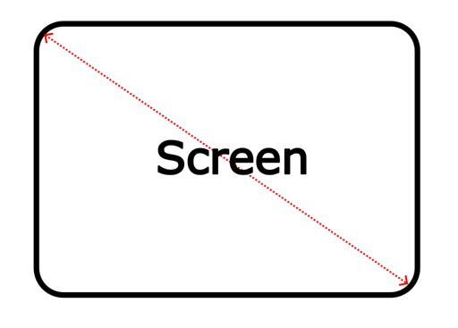

.. _ESP32_Display:

##############################################################################
Freenove ESP32 Display
##############################################################################

Freenove ESP32 Display Models
*****************************************

At the time this tutorial was written, Freenove ESP32 Display is available in five different models. While they may vary in drivers, resolution, or screen size, this guide applies to all of them. Below is a list of the supported models, along with corresponding images:

.. table:: 
    :class: freenove-ow

    +--------------+------------+----------+-------------+
    | Models       | Specifications        | Images      |
    +==============+============+==========+=============+
    | FNK0103F_2P8 | Size       | 2.8 inch | |Display00| |
    +              +------------+----------+             |
    |              | Resolution | 240x320  |             |
    +              +------------+----------+             |
    |              | Driver     | ILI9341  |             |
    +--------------+------------+----------+-------------+
    | FNK0103B_2P8 | Size       | 2.8inch  | |Display01| |
    +              +------------+----------+             |
    |              | Resolution | 240x320  |             |
    +              +------------+----------+             |
    |              | Driver     | ST7789   |             |
    +--------------+------------+----------+-------------+
    | FNK0103L_3P2 | Size       | 3.2inch  | |Display02| |
    +              +------------+----------+             |
    |              | Resolution | 240x320  |             |
    +              +------------+----------+             |
    |              | Driver     | ST7789   |             |
    +--------------+------------+----------+-------------+
    | FNK0103N_3P5 | Size       | 3.5inch  | |Display03| |
    +              +------------+----------+             |
    |              | Resolution | 320x480  |             |
    +              +------------+----------+             |
    |              | Driver     | ST7796   |             |
    +--------------+------------+----------+-------------+
    | FNK0103S_4P0 | Size       | 4.0inch  | |Display04| |
    +              +------------+----------+             |
    |              | Resolution | 320x480  |             |
    +              +------------+----------+             |
    |              | Driver     | ST7796   |             |
    +--------------+------------+----------+-------------+

Related Knowledge
********************************

Screen Size
================================

An internationally recognized unit of length, the inch (equivalent to 2.54 centimeters) has been the standard measurement for screen sizes in the display industry with a long history. This convention originated in the early television era when British manufacturers first adopted inches to measure cathode-ray tube (CRT) dimensions. The practice quickly became the global norm and remains the industry standard today.

A critical clarification: screen size always refers to the diagonal measurement of the display panel. For instance, a 4-inch display features a 4-inch (10.16 cm) diagonal, ensuring standardized and comparable sizing across all devices.

Resolution
================================

Screen resolution quantifies a display's pixel density along its horizontal and vertical axes, expressed as width × height (e.g., 320 × 480). This specification applies universally across displays, such as smartphones, monitors, and television screens.

* **Pixel:** The smallest unit of a display, composed of red (R), green (G), and blue (B) subpixels. Through precise brightness variation, these subpixels generate the complete color spectrum.

* **Resolution vs. Clarity:** Higher resolution means more pixels per unit area, resulting in sharper and more detailed imagery.

Display Driver
==================================

The display driver IC serves as the core component of display panels, processing signals from the main controller and controlling pixel illumination. Below is an overview of three widely used display driver ICs.

.. table::
    :class: zebra
    :align: center

    +-------------------+--------------------+-----------------------------------------------+
    | Display Driver IC |     Resolution     |                  Advantages                   |
    +===================+====================+===============================================+
    | ILI9341           | 240x320            | widely used with abundant resources available |
    +-------------------+--------------------+-----------------------------------------------+
    | ST7789            | 240x320 or 240x240 | Suitable for learning and development         |
    +-------------------+--------------------+-----------------------------------------------+
    | ST7796            | 320x480            | High-definition display with richer colors    |
    +-------------------+--------------------+-----------------------------------------------+

