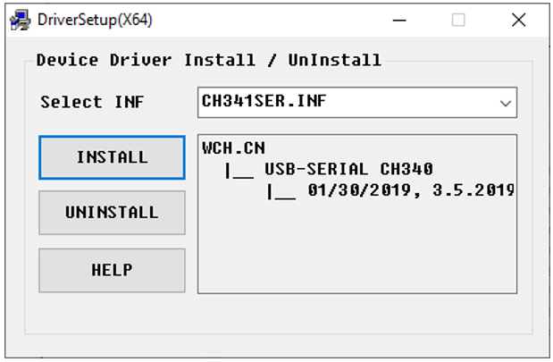
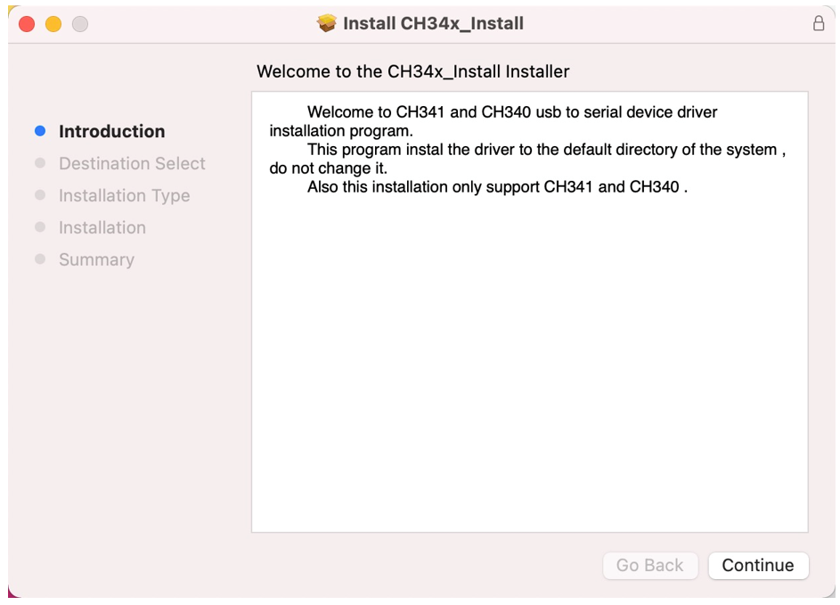
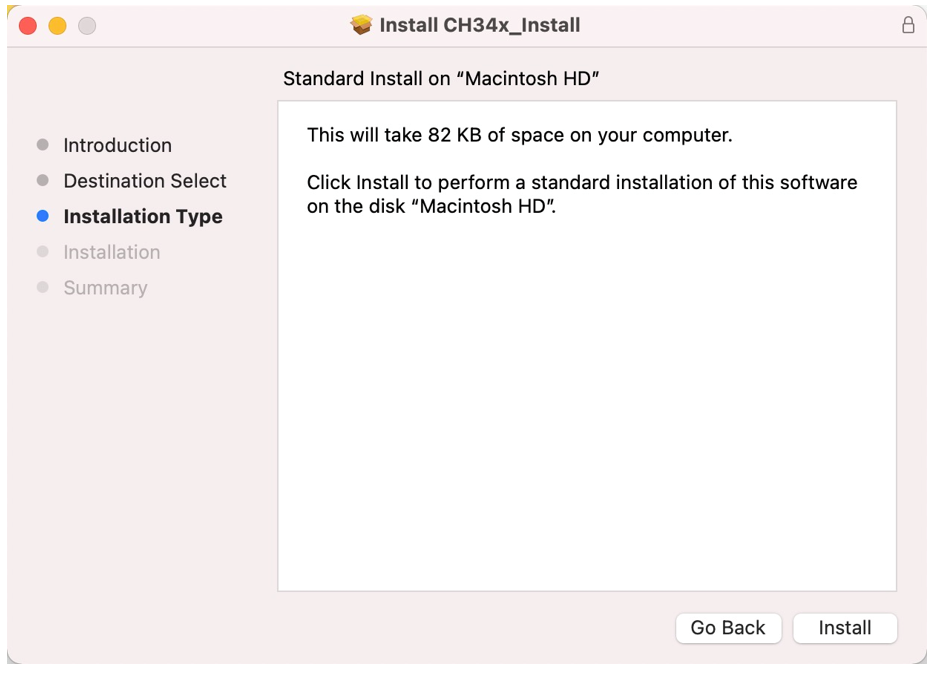
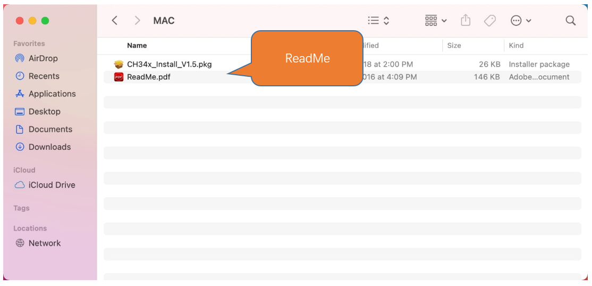

##############################################################################
Preface
##############################################################################

ESP32-WROOM
**********************

The ESP32-WROOM offers two antenna options: the PCB on-board antenna and the IPEX antenna.

* The PCB on-board antenna is an integrated antenna within the chip module itself, making it compact and convenient for both portability and design.

* The IPEX antenna is an external metal antenna connected to the module's integrated antenna, providing enhanced signal performance.

.. table::
    :align: center
    :class: table-line
    :widths: 1 1

    +----------------------+--------------+
    | PCB on-board antenna | IPEX antenna |
    |                      |              |
    | |Preface00|          | |Preface01|  |
    +----------------------+--------------+

The ESP32-WROOM of this product is based on the ESP32-WROOM-32E module with built-in PCB on-board antenna.

.. table::
    :align: center
    :class: table-line
    :widths: 1 1

    +-------------+-------------+
    | Top         | Bottom      |
    |             |             |
    | |Preface02| | |Preface03| |
    +-------------+-------------+

.. |Preface03| image:: ../_static/imgs/Preface/Preface03.png

Freenove ESP32 Display is available in five different models. While they may vary in drivers, resolution, or screen size, this guide applies to all of them. For detailed model specifications, please click :ref:`here <ESP32_Display>`.

For datasheet of the ESP32 module, please visit: https://www.espressif.com.cn/sites/default/files/documentation/esp32-wroom-32e_esp32-wroom-32ue_datasheet_en.pdf

Freenove ESP32 Display
***************************

Hardware Interfaces
=========================

.. note::

    :combo:`red font-bolder:The 2.8-inch version does not provide access to the I2C interface or IO39 pin.`

.. _Battery:

Battery (Optional)
=======================

:combo:`red font-bolder:Please note that this product does not come with lithium batteries; please purchase them yourself.`

This device supports both **USB-powered and lithium battery-powered operation.** For optimal safety, USB power is recommended. Due to the :combo:`red font-bolder:hazardous nature of lithium batteries`, we advise against their use unless absolutely necessary.

This device features an **MX1.25mm** connector and supports lithium batteries of various capacities. Note: The input voltage must be maintained within 3.7-4.2V range.

Market-available batteries may feature **two distinct wiring configurations where the positive (+) and negative (-) terminals are reversed between models.** Please verify the battery's wiring matches the product requirements (refer to the diagram below) to prevent equipment failure or safety risks due to improper connection.

**The** :combo:`red font-bolder:red cable` **is the positive terminal while the black one is negative.**

**We recommend using a charger specially designed for lithium batteries. Due to various specifications and quality of lithium batteries, using a proper charger helps ensure peak performance, safety, and battery longevity.**

**While our product also supports USB charging as a backup option, please note that this method does not support fast charging and is limited to standard slow charging.**

.. _Speaker:

Speaker
========================

There is a speaker connector (PH1.25mm) on the Freenove ESP32 Display. It is recommended to use an :combo:`red font-bolder:8Ω 1W speaker`.

:combo:`red font-bolder:Please note that this kit does not include a speaker. Please buy one yourself.`

.. _SD_card:

SD Card
========================

The connector circuit uses SPI communication and supports high-speed Micro SD card storage.

.. table::
    :class: zebra
    :align: center

    +---------+--------+------------+
    |  Item   |  Pins  | Definition |
    +=========+========+============+
    | SD Card | GPIO23 | SD_CMD     |
    |         +--------+------------+
    |         | GPIO18 | SD_CLK     |
    |         +--------+------------+
    |         | GPIO19 | SD_D0      |
    |         +--------+------------+
    |         | GPIO5  | SD_CS      |
    +---------+--------+------------+

.. note::

    :combo:`red font-bolder:This product does not include SD cards or SD card readers. Please buy them yourself.`

TFT Screen
===========================

Freenove ESP32 Display is available in five different models with various TFT screen. This guide applies to all of them. For detailed model specifications, please click :ref:`here <ESP32_Display>`.

.. table::
    :class: zebra
    :align: center

    +------------+--------+------------+
    |    Item    |  Pins  | Definition |
    +============+========+============+
    | TFT Screen | GPIO13 | LCD_MOSI   |
    |            +--------+------------+
    |            | GPIO12 | LCD_MISO   |
    |            +--------+------------+
    |            | GPIO14 | LCD_SCK    |
    |            +--------+------------+
    |            | GPIO2  | LCD_RS     |
    |            +--------+------------+
    |            | GPIO15 | LCD_CS     |
    +------------+--------+------------+

RGB LED
============================

The Freenove ESP32 Display includes an RGB LED (red, green, blue) that can blend colors to create various lighting effects.

.. table::
    :class: zebra
    :align: center

    +------+--------+
    | Item | Pins   |
    +======+========+
    | R    | GPIO22 |
    +------+--------+
    | G    | GPIO16 |
    +------+--------+
    | B    | GPIO17 |
    +------+--------+

GPIO Pinout Table
=============================

To learn what each GPIO corresponds to, please refer to the following table.

The functions of the pins are allocated as follows:

.. table:: 
    :align: center
    :class: zebra

    +----------------+-----------+-------------+
    | ESP32-S3 N16R8 | Functions | Description |
    +================+===========+=============+
    | GPIO22         | R         | RGB         |
    +----------------+-----------+             |
    | GPIO16         | G         |             |
    +----------------+-----------+             |
    | GPIO17         | B         |             |
    +----------------+-----------+-------------+
    | GPIO13         | LCD_MOSI  | TFT_LCD     |
    +----------------+-----------+             |
    | GPIO12         | LCD_MISO  |             |
    +----------------+-----------+             |
    | GPIO14         | LCD_SCK   |             |
    +----------------+-----------+             |
    | GPIO2          | LCD_RS    |             |
    +----------------+-----------+             |
    | GPIO15         | LCD_CS    |             |
    +----------------+-----------+-------------+
    | GPIO23         | SD_CMD    | SD Card     |
    +----------------+-----------+             |
    | GPIO18         | SD_CLK    |             |
    +----------------+-----------+             |
    | GPIO19         | SD_D0     |             |
    +----------------+-----------+             |
    | GPIO5          | SD_CS     |             |
    +----------------+-----------+-------------+

For more information, refer to the schematic.

**If you have any concerns, please feel free to contact us via** support@freenove.com

CH340 (Required)
****************************************

ESP32 uses CH340 to download codes. So before using it, we need to install CH340 driver in our computers.

Windows
===================================

Check whether CH340 has been installed
-------------------------------------------

1. Connect your computer and ESP32-WROOM with a USB cable.

2. Turn to the main interface of your computer, select “**This PC**” and right-click to select “**Manage**”.

3. Click “Device Manager”. If your computer has installed CH340, you can see“USB-SERIAL CH340 (COMx)”. And you can click :ref:`here <Programming_Software>` to move to the next step.

Installing CH340
----------------------

1. First, download CH340 driver, click http://www.wch-ic.com/search?q=CH340&t=downloads to download the appropriate one based on your operating system.

If you would not like to download the installation package, you can open "“Freenove_ESP32_Display/CH340", we have prepared the installation package.

2. Open the folder “Freenove_ESP32_Display/CH340/Windows/”

3. Double click “**CH341SER.EXE**”.

4. Click "INSTALL" and wait for the installation to complete.

5. Install successfully. Close all interfaces.

6. When ESP32 is connected to computer, select “This PC”, right-click to select “Manage” and click “Device Manager” in the newly pop-up dialog box, and you can see the following interface.

7. So far, CH340 has been installed successfully. Close all dialog boxes. 

MAC
=======================================

First, download CH340 driver, click http://www.wch-ic.com/search?q=CH340&t=downloads to download the appropriate one based on your operating system.

If you would not like to download the installation package, you can open **"Freenove_ESP32_Display/CH340"**. We have prepared the installation package.

Second, open the folder **"Freenove_ESP32_Display/CH340/MAC/"**

Third, click Continue.

Fourth, click Install.

Then, waiting Finish.

Finally, restart your PC.

If it fails to be installed with the above steps, you can refer to readme.pdf to install it. 

.. _Programming_Software:

Programming Software
************************************

We use the Arduino Software (IDE) to write and upload the code for this product.

First, install Arduino Software (IDE): visit https://www.arduino.cc/en/software/, Select and download corresponding installer according to your operating system. If you are a Windows user, please select the "Windows" to download and install it correctly.

After the download completes, run the installer. For Windows users, there may pop up an installation dialog box of driver during the installation process. When it popes up, please allow the installation.

After installation completes, an Arduino Software shortcut will be generated in the desktop. Run the Arduino Software.

.. image:: ../_static/imgs/Preface/Preface38.png
    :align: center

The interface of Arduino Software is as follows:

Programs written with Arduino Software (IDE) are called sketches. These sketches are written in the text editor and saved with the file extension.ino. The editor features text cutting/pasting and searching/replacing. The message area gives feedback while saving and exporting and also displays errors. The console displays text output by the Arduino Software (IDE), including complete error messages and other information. The bottom right-hand corner of the window displays the configured board and serial port. The toolbar buttons allow you to verify and upload programs, create, open, and save sketches, and open the serial monitor.

.. table:: 
    :align: center
    :class: table-line

    +-------------+-----------------------------------------------------------------------------------------+
    | |Preface40| | Verify                                                                                  |
    |             |                                                                                         |
    |             | Check your code for compile errors.                                                     |
    +-------------+-----------------------------------------------------------------------------------------+
    | |Preface41| | Upload                                                                                  |
    |             |                                                                                         |
    |             | Compile your code and upload them to the configured board.                              |
    +-------------+-----------------------------------------------------------------------------------------+
    | |Preface42| | Debug                                                                                   |
    |             |                                                                                         |
    |             | Debug code running on the board. (Some development boards do not support this function) |
    +-------------+-----------------------------------------------------------------------------------------+
    | |Preface43| | Development board selection                                                             |
    |             |                                                                                         |
    |             | Configure the support package and upload port of the development board.                 |
    +-------------+-----------------------------------------------------------------------------------------+
    | |Preface44| | Serial Plotter                                                                          |
    |             |                                                                                         |
    |             | Receive serial port data and plot it in a discounted graph.                             |
    +-------------+-----------------------------------------------------------------------------------------+
    | |Preface45| | Serial Monitor                                                                          |
    |             |                                                                                         |
    |             | Open the serial monitor.                                                                |
    +-------------+-----------------------------------------------------------------------------------------+

.. |Preface43| image:: ../_static/imgs/Preface/Preface43.png

Additional commands are found within the five menus: File, Edit, Sketch, Tools, Help. The menus are context sensitive, which means only those items relevant to the work currently being carried out are available.

Environment Configuration
********************************

First, open the software platform Arduino, and then click File in Menus and select Preferences.

Second, click on the symbol behind "Additional Boards Manager URLs" 

Third, fill in https://raw.githubusercontent.com/espressif/arduino-esp32/gh-pages/package_esp32_index.json in the new window, click OK, and click OK on the Preferences window again.

.. note::

    :combo:`red font-bolder:if you copy and paste the URL directly, you may lose the "-". Please check carefully to make sure the link is correct.`

Fourth, click "Boards Manager". Enter "esp32" in Boards manager, select 3.2.0, and click "INSTALL".

Arduino will download these files automatically. Wait for the installation to complete. 

When finishing installation, click Tools in the Menus again and select Board: "ESP32 Dev Module", and then you can see information of ESP32. 

Library Installation
***************************

Before starting the learning process, it is necessary to install some libraries in advance to enable the code to be compiled properly. For convenience, we have already packaged these libraries and placed them in the Freenove_ESP32_Display/Libraries folder. Please refer to the following steps to install these libraries into the Arduino IDE.

1. Open Arduino IDE.

2. Select Sketch->Include Library->Add .ZIP library...

3. On the newly pop-up window, select the files from the Freenove_ESP32_Display /Libraries. Click Open to install the library.

4. Repeat the above steps until all the six libraries are installed to Arduino. So far, all libraries have been installed.

.. note:: 

    :combo:`red font-bolder:Some libraries are not the latest version. Please do not update them even if it prompts every time you open the IDE. Just click LATER. Otherwise, it may lead to compilation failure.`

