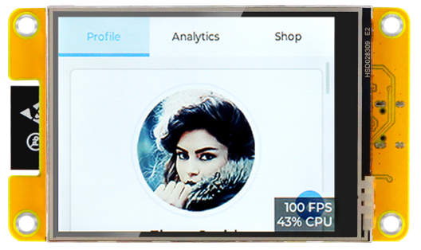
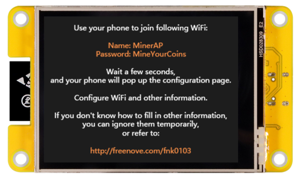

######################################################
FNK0103/FNK0114
######################################################

Freenove ESP32 Display
******************************************************

When you first power on the Freenove ESP32 Display, one of the following two interfaces may occur.When you first power on the Freenove ESP32 Display, you will see either the LVGL demo or the Freenove Miner firmware. Regardless of which one appears, you can learn how to operate the display by following the tutorial in the chapters ahead.

Download
====================================================

Please download the full resources including code examples, datasheets, etc. first.

`Click to download <https://github.com/Freenove/Freenove_ESP32_Display/archive/refs/heads/main.zip>`_

Support
====================================================

We are fully responsible for our products!

Please feel free to send us an email if you have any concerns,
whether they are questions before buying or problems in use.

`support@freenove.com <support@freenove.com>`_

In general, we will reply to you within one working day.

Documentation
====================================================

This product provides the following online documents.

.. toctree::
   :maxdepth: 1
   :caption: FNK0103/FNK0114

   fnk0103/codes/tutorial.rst
   fnk0103/codes/Miner.rst